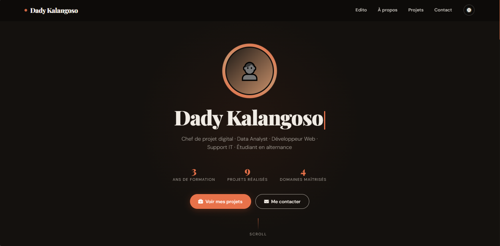

# 🧑‍💼 Portfolio — Dady Kalangoso

Portfolio personnel multi-profil développé en HTML/CSS/JS. Pensé pour s'adapter dynamiquement à différents postes cibles sans changer de page.

---
## 📸 Aperçu 


---

## 📁 Structure du projet

```
portfolio/
|__README.md
├── index.html       # Structure HTML de la page
├── style/ style.css        # Styles et thème (clair/sombre)
└── js/ script.js        # Logique dynamique, profils, animations
```

---

## ✨ Fonctionnalités

- **Profil unique statique** — toutes les compétences et projets affichés directement, sans interaction requise.
- **Compétences par domaine** — 4 blocs organisés : Gestion de projet & Admin, Data & Analyse, Développement Web, Support IT.
- **9 projets académiques et pro** — cartes avec effet flip 3D au survol, révélant description et tags.
- **Mode sombre / clair** — bascule via le bouton en header, respecte la préférence système par défaut.
- **Animations au scroll** — révélation progressive des sections via `IntersectionObserver`.
- **Compteurs animés** — chiffres clés animés à l'entrée dans le viewport.
- **Carrousel édito** — 3 slides avec navigation manuelle et défilement automatique (5s).
- **Formulaire de contact** — validation en temps réel (blur) et à la soumission, message de succès simulé.
- **Menu responsive** — hamburger mobile avec overlay et fermeture au clic sur lien.
- **Accessibilité** — skip link, rôles ARIA, `aria-label`, navigation clavier.

---

## 🚀 Lancement

Aucune dépendance, aucun build requis. Ouvrir directement dans un navigateur :

```bash
# Option 1 — double-clic sur index.html
# Option 2 — serveur local (recommandé)
npx serve .
# ou
python -m http.server 8000
```

---

## 🎨 Personnalisation

### Changer les couleurs

Les variables CSS sont centralisées en haut de `style.css` :

```css
:root {
  --bg: #f5f2ee;
  --bg2: #ebe6df;
  --text: #1a1713;
  --text-muted: #6b6560;
  --accent: #c8502a;
  --accent2: #e8a87c;
  --white: #fefdfb;
  --header-bg: #1a1713;
  --header-text: #f5f2ee;
  --card-bg: #fefdfb;
  --shadow: 0 4px 32px rgba(26, 23, 19, 0.1);
  --radius: 16px;
  --nav-height: 72px;
  --transition: 0.38s cubic-bezier(0.4, 0, 0.2, 1);
}
```

### Modifier les compétences

Dans `index.html`, chaque domaine est un bloc `.skills-domain-block` :

```html
<div class="skills-domain-block">
  <p class="skills-domain-label">📋 Gestion de projet & Admin</p>
  <div class="skills-list">
    <span class="skill-chip">Agile · Scrum</span>
    <!-- ajouter ou supprimer des skill-chip ici -->
  </div>
</div>
```

### Ajouter un projet

Dans `index.html`, copier un bloc `<article class="flip-card ...">` et l'adapter :

```html
<article
  class="flip-card reveal reveal-delay-1"
  role="listitem"
  aria-label="Projet N"
>
  <div class="flip-inner">
    <div class="flip-front">
      <div class="flip-front-img" aria-hidden="true">🚀</div>
      <div class="flip-front-body">
        <h3>Titre du projet</h3>
        <span>Catégorie</span>
      </div>
    </div>
    <div class="flip-back">
      <div>
        <h3>Titre du projet</h3>
        <p>Description courte du projet et résultat obtenu.</p>
      </div>
      <div class="flip-back-tags">
        <span class="tag">Tag1</span>
        <span class="tag">Tag2</span>
      </div>
    </div>
  </div>
</article>
```

### Ajouter une photo de profil

Remplacer dans `index.html` :

```html
<!-- Remplacer le bloc .profile-img-placeholder par : -->

```

---

## 🗂️ Projets présents

| #   | Projet                                    | Domaine                  |
| --- | ----------------------------------------- | ------------------------ |
| 1   | Projet Nexora — Site web                  | Gestion de projet        |
| 2   | Dashboard Jeu Mobile                      | Power BI · Data Analyst  |
| 3   | Football Hub                              | Full Stack Data          |
| 4   | Outils de gestion admin                   | Excel · Process · Notion |
| 5   | Assistant informatique (Kraft ONG)        | Support IT               |
| 6   | Générateur de rapports PDF                | Python · Automatisation  |
| 7   | Étude de faisabilité — Aide à la conduite | Analyse produit          |
| 8   | Étude de marché Nespresso                 | Stratégie & Business     |
| 9   | Portfolio web personnel                   | Développement Front-End  |

---

## 🛠️ Technologies

| Technologie                              | Usage                             |
| ---------------------------------------- | --------------------------------- |
| HTML5 sémantique                         | Structure et accessibilité        |
| CSS3 (variables, grid, animations)       | Mise en page et thème             |
| JavaScript ES6+ vanilla                  | Animations, carrousel, formulaire |
| Font Awesome 6                           | Icônes                            |
| Google Fonts (Playfair Display, DM Sans) | Typographie                       |

---

## 📬 Contact

**Dady Kalangoso**

- 📧 dady.kalangosokangela@epfedu.fr
- 📞 06 95 12 84 43
- 📍 Dampmart, Île-de-France
- 🔗 [LinkedIn](https://www.linkedin.com/in/kalangosod/)
- 🐙 [GitHub](https://github.com/dkaizen12)

---

_Portfolio développé sans framework — HTML, CSS et JS natifs uniquement._
